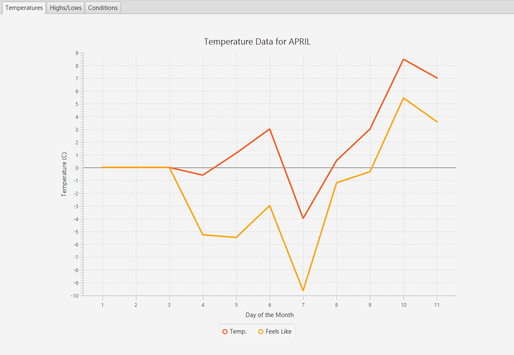

# Weather Data Visualizer

## Overview

A WIP project for a data visualizer. 
Running the program connects it to the OpenWeather API to grab data for the current weather and stores the data in a CSV file. The CSV file is then used to provide data to the application to be displayed on graphs. Updating and displaying data, creating new files at the start of the month, and determining which file to load on launch is done automatically.

There is still a lot I can add/improve, and I will continue to work on the project as I learn more about JavaFX GUIs.

## Additional Notes

- Requires the JavaFX SDK (using [javafx-sdk-20](https://gluonhq.com/products/javafx/))
- Requires an API key to connect to the [OpenWeather API](https://openweathermap.org/)
